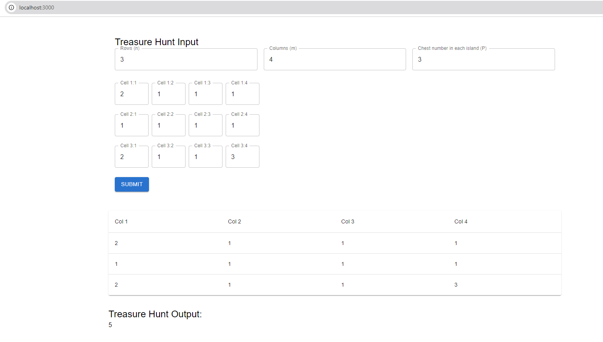

# Treasure Hunt App

## Giới thiệu

Dự án "Treasure Hunt App" là một ứng dụng để giải quyết bài toán sau:

**Viết code C# (backend) và react (frontend, ưu tiên dùng thư viện Material-UI) để giải quyết bài toán bên dưới Thông tin input được nhập và lưu vào database để có thể xem và giải lại. Hiển thị input nhập ma trận theo thông tin n, m và có validation.**

**Tìm kho báu**

Đoàn hải tặc tìm thấy một bản đồ kho báu, tuy nhiên để đến được kho báu thì phải vượt qua được thử 
thách. Vùng biển chứa kho báu là một ma trận các hòn đảo n hàng m cột, mỗi đảo có một chiếc rương 
đánh dấu bởi một số nguyên dương trong khoảng từ 1 đến p (tạm gọi là số x), và nó sẽ chứa chìa khoá 
cho chiếc rương đánh số x + 1. Và chỉ có chiếc rương được đánh số p (và là số lớn nhất) là chứa kho báu. 
Để đi từ hòn đảo (x1:y1) đến đảo (x2:y2) cần một lượng nhiên liệu là √(𝑥1 − 𝑥2)2 + (𝑦1 − 𝑦2)2
 . 

Hải tặc đang ở hòn đảo (1:1) - hàng 1 cột 1 và đã có sẵn chìa khoá số 0. Với việc cần tiết kiệm nhiên liệu 
để trở về, hãy tính lượng nhiên liệu ít nhất để lấy được kho báu. Biết rằng luôn có đường dẫn đến kho 
báu.

**Input**: 
* 3 số nguyên dương n,m,p (1 <= n, m <= 500 , 1 <= p <= n*m) – lần lượt là số hàng, số cột của ma 
trận và số p – số loại rương có thể có trên ma trận 
* Ma trận n hàng m cột, mỗi vị trí là một số nguyên biểu thị ma trận kho báu : a[i][j] (1 <= a[i][j] <= 
p) là số thứ tự của rương trong mỗi hòn đảo. Và chỉ có một hòn đảo chứa rương đánh số p. 

**Output**: 
Một số thực là lượng nhiên liệu nhỏ nhất mà hải tặc cần có để lấy được rương kho báu. 

**Example**: 

Test 1: 

Input: 
n: 3 
m: 3 
p: 3 

3 2 2 

2 2 2 

2 2 1 

Output: 4√2 = 5.65685 

Test 2: 

Input: 
n: 3 
m: 4 
p: 3 

2 1 1 1 

1 1 1 1 

2 1 1 3 

Output: 5 

Test 3: 

Input: 
n: 3 
m: 4 
p: 12 

1 2 3 4 

8 7 6 5 

9 10 11 12 

Output: 11

## Cài Đặt Dự Án

### 1. Cài Đặt Backend (C#)

#### 1.1. Yêu Cầu

- .NET 8 SDK hoặc mới hơn
- [Cài Đặt SQL Server bằng Docker](#32-thi-t-lp-c-s-d-li-u)

#### 1.2. Cài Đặt và Chạy Dự Án

1. **Clone repository**:
    ```bash
    git clone https://github.com/your-username/treasure-hunt-app.git
    cd TreasureHuntAPI
    ```

2. **Mở dự án trong Visual Studio**:
   - Mở tệp `.sln` trong Visual Studio.

3. **Cài Đặt Dependencies**:
   - Mở Terminal trong Visual Studio hoặc Command Prompt và điều hướng đến thư mục dự án.
   - Chạy lệnh sau để cài đặt các gói NuGet cần thiết:
     ```bash
     dotnet restore
     ```

4. **Thiết Lập và Cập Nhật Cơ Sở Dữ Liệu**:
   - **Tạo Migration**: Chạy lệnh sau để tạo migration cho cơ sở dữ liệu:
     ```bash
     dotnet ef migrations add InitialCreate
     ```
   - **Cập Nhật Cơ Sở Dữ Liệu**: Chạy lệnh sau để áp dụng migration và cập nhật cơ sở dữ liệu:
     ```bash
     dotnet ef database update
     ```
   - **Khởi Tạo Cơ Sở Dữ Liệu**: Nếu bạn không sử dụng migrations, bạn có thể đảm bảo cơ sở dữ liệu được khởi tạo khi ứng dụng khởi chạy bằng cách thêm mã sau vào phương thức `Configure` trong `Startup.cs`:
     ```csharp
     using (var scope = app.Services.CreateScope())
     {
         var context = scope.ServiceProvider.GetRequiredService<TreasureDbContext>();
         context.Database.EnsureCreated();
     }
     ```

5. **Chạy Dự Án**:
   - Chạy lệnh sau để khởi chạy ứng dụng backend:
     ```bash
     dotnet run
     ```
   - Ứng dụng sẽ chạy trên địa chỉ mặc định `http://localhost:5107`.

### 2. Cài Đặt Frontend (React)

#### 2.1. Yêu Cầu

- Node.js (phiên bản 14.x trở lên)
- npm (hoặc yarn)

#### 2.2. Cài Đặt và Chạy Dự Án

1. **Di chuyển đến thư mục frontend**:
    ```bash
    cd TreasureHuntFE/treasure-hunt-app
    ```

2. **Cài Đặt Dependencies**:
   - Chạy lệnh sau để cài đặt các gói npm cần thiết:
     ```bash
     npm install
     ```

3. **Cài Đặt Material-UI**:
   - Cài đặt Material-UI Core và Material-UI Icons:
     ```bash
     npm install @mui/material @emotion/react @emotion/styled
     ```
   - Cài đặt Material-UI Icons (nếu bạn cần sử dụng các biểu tượng):
     ```bash
     npm install @mui/icons-material
     ```
4. **Cài Đặt Formik và Yup**:
   - Cài đặt Formik cho quản lý form và Yup cho validation:
     ```bash
     npm install formik yup
     ```
5. **Chạy Dự Án**:
   - Chạy lệnh sau để khởi chạy ứng dụng frontend:
     ```bash
     npm start
     ```
   - Ứng dụng sẽ chạy trên địa chỉ mặc định `http://localhost:3000`.

6. **Xem Kết Quả**:
   - Mở trình duyệt và truy cập vào địa chỉ `http://localhost:3000`.

#### 2.3. Giao diện nhập ma trận và kết quả tính toán
   - Bạn sẽ thấy giao diện sau và bạn có thể nhập thông tin ma trận và nhận kết quả tính toán.
   
   

### 3. Cài Đặt SQL Server bằng Docker

#### 3.1. Yêu Cầu

- Docker (cài đặt [Docker Desktop](https://www.docker.com/products/docker-desktop) nếu chưa có)

#### 3.2. Thiết Lập Cơ Sở Dữ Liệu

1. **Tạo tệp `docker-compose.yml`** trong thư mục gốc của dự án với nội dung sau:
    ```yaml
    version: '3.8'

    services:
      sqlserver:
        image: mcr.microsoft.com/mssql/server:2019-latest
        container_name: sqlserver_container
        environment:
          SA_PASSWORD: "TreasureHunt@Password"
          ACCEPT_EULA: "Y"
        ports:
          - "1433:1433"
        volumes:
          - sqlserverdata:/var/opt/mssql

    volumes:
      sqlserverdata:
        driver: local
    ```

2. **Khởi Chạy Docker Compose**:
   - Trong terminal, điều hướng đến thư mục chứa tệp `docker-compose.yml` và chạy:
     ```bash
     docker-compose up -d
     ```

   - Lệnh trên sẽ tải hình ảnh SQL Server, tạo và khởi chạy container. Cơ sở dữ liệu SQL Server sẽ được mở trên cổng 1433.

3. **Kết Nối Backend với SQL Server**:
   - Đảm bảo rằng chuỗi kết nối trong ứng dụng backend trỏ đến `localhost,1433` và sử dụng mật khẩu `TreasureHunt@Password` cho người dùng `sa`.

## Tài Liệu Tham Khảo

- [C# Documentation](https://docs.microsoft.com/en-us/dotnet/csharp/)
- [React Documentation](https://reactjs.org/docs/getting-started.html)
- [Material-UI Documentation](https://mui.com/getting-started/installation/)
- [Docker Documentation](https://docs.docker.com/get-started/)
